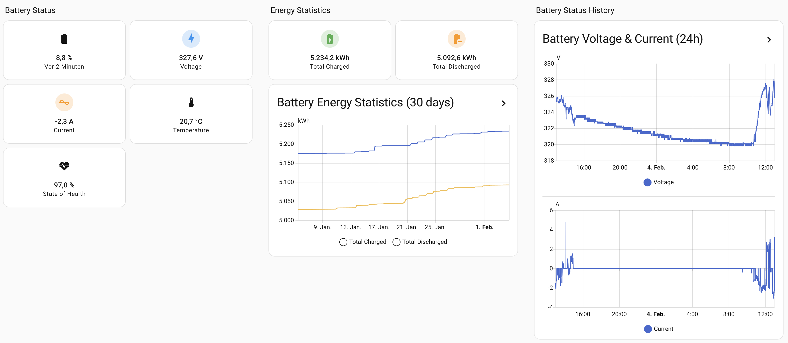
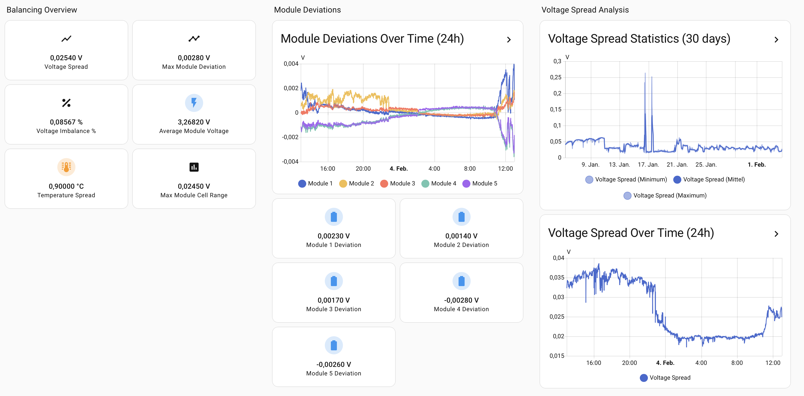
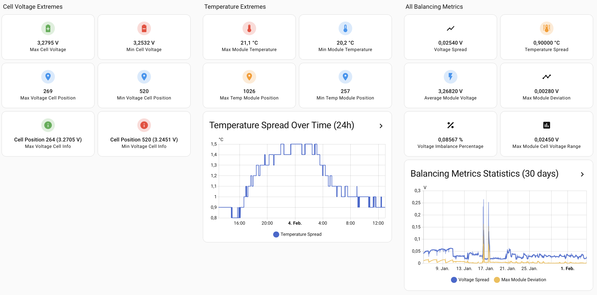
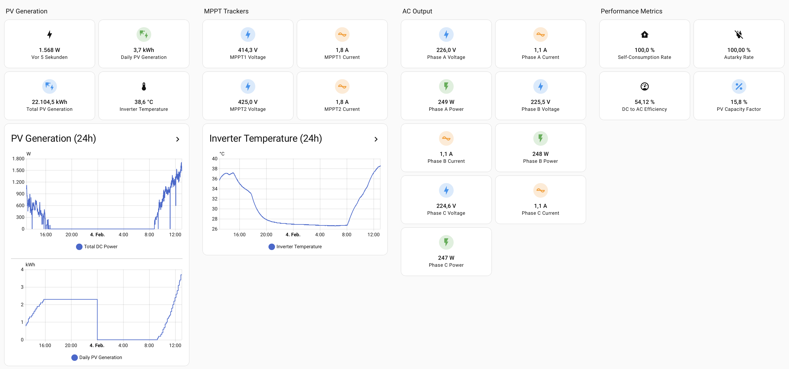
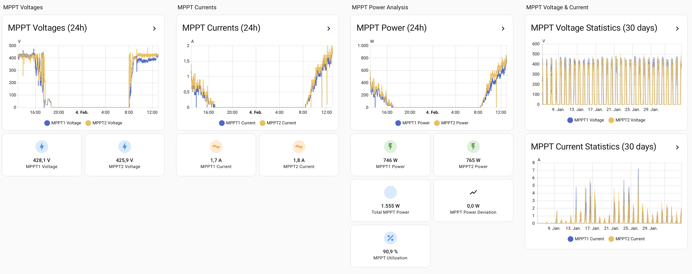
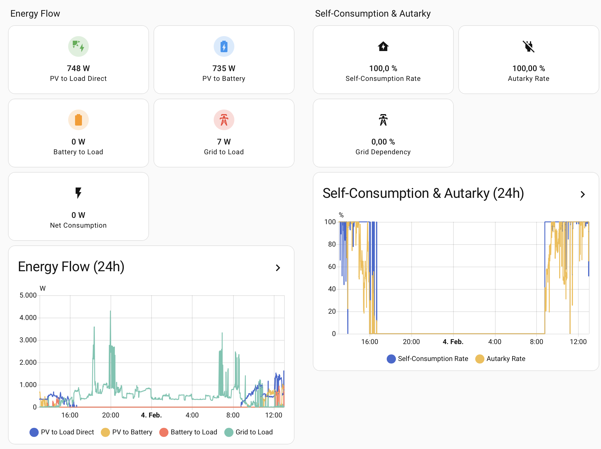
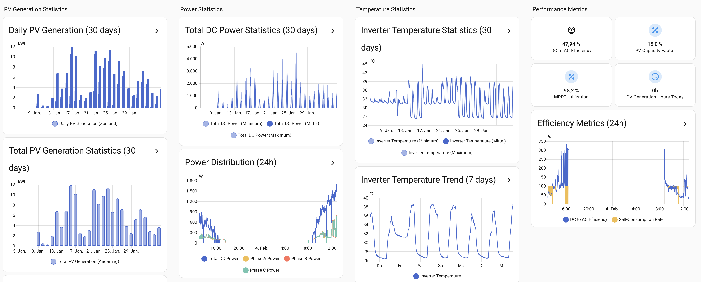

# Dashboard Examples

This folder contains example dashboard configurations for the Modbus Manager integration.

## Screenshot Examples

### Battery Dashboards

### PV Dashboards

## Dashboard Files

### Battery Dashboards

#### sungrow_sbr_battery_analysis_standard.yaml
Standard Home Assistant cards version with new Sections layout. Uses only built-in HA cards.

#### sungrow_sbr_battery_analysis_mushroom.yaml
Mushroom Cards version with new Sections layout. Requires Mushroom Cards (HACS).

#### sungrow_sbr_battery_analysis_simple.yaml
Simplified version using only built-in Home Assistant cards. No custom cards required - works out of the box!

#### sungrow_sbr_battery_analysis.yaml
Legacy version with custom cards (Mushroom Cards and ApexCharts Card) for a modern, visually appealing interface.

### PV Dashboards

#### sungrow_pv_analysis_standard.yaml
Standard Home Assistant cards version with new Sections layout. Uses only built-in HA cards for PV monitoring. **Includes** integrated device info, status, and alarm/fault views.

#### sungrow_pv_analysis_mushroom.yaml
Mushroom Cards version with new Sections layout. Requires Mushroom Cards (HACS). **Includes** integrated device info, status, and alarm/fault views.

#### sungrow_pv_analysis_simple.yaml
Simplified version using only built-in Home Assistant cards. No custom cards required - works out of the box! **Includes** integrated device info, status, and alarm/fault views.

### Chart-Focused Dashboard

#### sungrow_charts_examples.yaml
Chart-focused dashboard inspired by Grafana and advanced energy monitoring layouts. Contains:
- **Self-Consumption & Autarky**: Current (real-time) rates, today's daily rates, and 30-day bar chart
- **Energy Flow**: Power flow breakdown and 24h line chart
- **Energy Balance**: Daily PV/import/export/consumption as 30-day bar charts, plus today's totals
- **PV & Power Trends**: PV generation history, phase power, DC power statistics

Use this as a template for building custom chart-heavy dashboards.

### Standalone Diagnostic Dashboard

#### sungrow_inverter_status_diagnostic.yaml
Standalone dashboard for inverter status and diagnostic registers only (device identity, protocol/firmware versions, running state, Master/Slave configuration, battery alarms/faults). Use this if you prefer a separate diagnostic dashboard. **Note:** The PV analysis dashboards above now include these diagnostic views.

## Installation

All dashboards follow the same installation process:

1. Copy the dashboard YAML file to your Home Assistant configuration directory
2. **Important**: Replace all instances of `{PREFIX}` with your actual device prefix
   - Battery example: `sensor.{PREFIX}_battery_1_voltage` → `sensor.SBR_battery_1_voltage`
   - PV example: `sensor.{PREFIX}_total_dc_power` → `sensor.SG_total_dc_power`
3. **Adjust for your device configuration**: Review and remove or comment out entities that are not available on your device
   - **Battery dashboards**: If you have fewer modules, remove references to modules you don't have (e.g., if you have 6 modules, remove references to modules 7 and 8)
   - **PV dashboards**: If you have fewer MPPT trackers, remove references to MPPT trackers you don't have (e.g., if you have 2 MPPTs, remove references to MPPT 3 and 4)
   - **PV dashboards**: If you have single-phase, remove references to Phase B and Phase C entities
   - **EMS Control**: Some entities are conditional (e.g., `inverter_run_mode`, `export_power_limit` not on iHomeManager; `pv_power_limitation` only on SHT models; battery controls only when battery is configured)
   - **Status & diagnostic dashboards**: Firmware entities are only available on RT/T/K6 models; battery alarm/fault entities only when a battery is configured
   - **Self-Consumption & Autarky Today**: `self_consumption_rate_today` and `autarky_rate_today` (calculated from daily energies per standard formulas) may be unavailable on iHomeManager or systems without meter; remove from YAML if they show as unavailable
   - If entities show as "unavailable" after import, they may not exist for your device configuration
   - Search for entity IDs in the YAML and remove/comment out unavailable ones to avoid dashboard errors
4. Import the dashboard in Home Assistant:
   - Go to **Settings** → **Dashboards** → **+ New Dashboard**
   - Choose **Import from YAML**
   - Paste the content of the YAML file (after replacing `{PREFIX}` and adjusting for your device)

## Sungrow SBR Battery Analysis Dashboard

Both dashboard files provide comprehensive monitoring and analysis for Sungrow SBR battery systems.

### Features

- **Battery Overview**: Main status indicators (SoC, Voltage, Current, Temperature, SoH)
- **Balancing Analysis**: Voltage spread, module deviations, and imbalance metrics
- **Module Details**: Cell voltage ranges and comparisons per module
- **Advanced Metrics**: Historical data and detailed balancing metrics

### Dashboard Structure

The battery dashboard is organized into 4 views:

1. **Battery Overview** (`/overview`) - Main battery status cards and energy statistics
2. **Balancing Analysis** (`/balancing`) - Voltage spread, module deviations, and imbalance metrics
3. **Module Details** (`/modules`) - Cell voltage ranges and comparisons per module
4. **Advanced Metrics** (`/advanced`) - Historical data and detailed balancing metrics

## Sungrow PV Analysis Dashboard

The PV dashboards provide comprehensive monitoring and analysis for Sungrow PV inverter systems.

### Features

- **PV Overview**: Main status indicators (Total DC Power, Daily/Total PV Generation, Inverter Temperature)
- **MPPT Analysis**: Individual MPPT tracker voltages, currents, and power analysis
- **AC Output**: Phase voltages, currents, and power for 3-phase systems
- **Energy Flow**: PV-to-load/battery/grid flows, self-consumption, autarky (current, today, 30-day chart)
- **Statistics**: Long-term generation statistics and trends
- **EMS Control**: Energy management settings (EMS mode, Min/Max SoC, export limits, battery controls). Similar to [mkaiser's EMS control tab](https://github.com/mkaiser/Sungrow-SHx-Inverter-Modbus-Home-Assistant/blob/main/doc/dashboard.md).
- **Status & Diagnostics**: Device identity, protocol/firmware, system status, Master/Slave, battery alarms/faults (all in one tab)

### Dashboard Structure

The PV dashboard is organized into 6 views:

1. **PV Overview** (`/overview`) - PV generation status, MPPT tracker information, AC output details, and historical charts
2. **MPPT Analysis** (`/mppt`) - MPPT voltage/current/power trends and individual tracker details
3. **Energy Flow Analysis** (`/energy-flow`) - Energy flow breakdown, self-consumption & autarky (current/today/30-day chart)
4. **Statistics** (`/statistics`) - Daily/total generation statistics, power distribution, and temperature trends
5. **EMS Control** (`/ems-control`) - EMS mode, battery SoC/backup, export limits, forced charge/discharge (remove unavailable entities for your setup)
6. **Status & Diagnostics** (`/diagnostics`) - Device identity, protocol/firmware, system status, Master/Slave config, battery alarms & faults (all in one tab)

## Sungrow Inverter Status & Diagnostic Dashboard

The status & diagnostic dashboard provides a central view for device info, firmware versions, running state, and alarm/fault indicators.

### Features

- **Device Info & Versions**: Serial number, device model, nominal power, output type, protocol version, ARM/DSP certification, inverter/comm/battery firmware
- **Status & Running State**: System state, running state flags, inverter temperature, Master/Slave mode/role/slave count
- **Alarms & Faults**: Battery fault, battery alarm, BMS alarm, BMS fault (when battery is configured)

### Dashboard Structure

1. **Device Info & Versions** (`/device-info`) - Identity, protocol, certification, firmware versions
2. **Status & Running State** (`/status`) - System and running state, Master/Slave configuration
3. **Alarms & Faults** (`/alarms`) - Battery-related fault and alarm indicators

**Note**: Some entities are conditionally available (e.g., firmware info only on RT/T/K6 models; battery alarms only when a battery is configured). Remove unavailable entities from the YAML if they show as unavailable.

## Required Custom Cards

Some dashboard versions require custom cards (install via HACS if not already installed):

- **Mushroom Cards** (`custom:mushroom-entity-card`)
  - HACS Repository: `https://github.com/piitaya/lovelace-mushroom`
  - Required for: `*_mushroom.yaml` versions

- **ApexCharts Card** (`custom:apexcharts-card`)
  - HACS Repository: `https://github.com/RomRider/apexcharts-card`
  - Required for: `sungrow_sbr_battery_analysis.yaml` (legacy version only)

**Note**: The `*_standard.yaml` and `*_simple.yaml` versions use only built-in Home Assistant cards and require no additional installations.

## Customization

You can customize any dashboard by:

- Adjusting color thresholds in the `icon_color` sections
- Adding or removing entities from the cards
- Modifying chart types and configurations
- Changing the layout (grid columns, card sizes, etc.)

### Color Coding

All dashboards use color coding to indicate status:

- **Green**: Normal/Good values
- **Orange**: Warning values
- **Red**: Critical values

Thresholds are configured in the card templates and can be adjusted based on your device specifications.

## Notes

- **Battery dashboards**: Assumes you have 8 modules configured. If you have fewer modules, some entities may show as "unavailable" - this is normal. Remove unavailable entities from the YAML to avoid errors.
- **PV dashboards**: Supports up to 4 MPPT trackers. If you have fewer trackers, some entities may show as "unavailable" - this is normal. For single-phase systems, only Phase A entities will be populated.
- All calculated entities use 5 decimal places precision for accurate analysis.
- Historical charts require the entities to have history enabled in Home Assistant.

## Support

For issues or questions about the Modbus Manager integration, please refer to the main project documentation or open an issue on GitHub.
