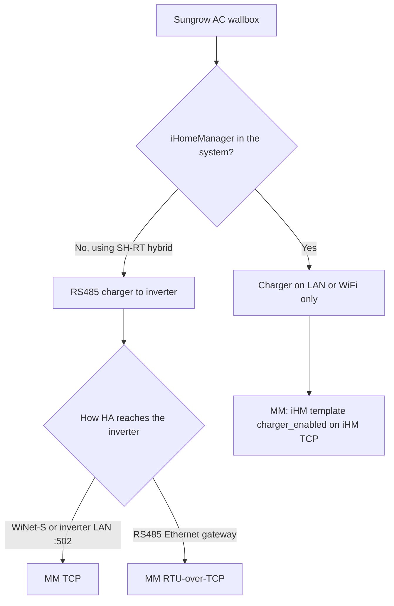

# Sungrow AC wallbox connection topologies

Applies to **AC007-00**, **AC011E-01**, and **AC22E-01**.

- **Without iHM:** [Sungrow AC011E Wallbox template](README_sungrow_ac011e_wallbox.md) (`21xxx` on the inverter bus).
- **With iHM:** [iHomeManager template](README_iHomeManager.md) (`charger_enabled`) — iHM is the EMS; do not add a second wallbox hub.

This page is about **wiring and which Modbus endpoint Home Assistant should use**. Surplus charging in iSolarCloud is Sungrow EMS behaviour.

> **Modbus Manager** uses Home Assistant’s `ModbusHub` (plain TCP, RTU-over-TCP, or serial). It does **not** speak **Modbus/TLS**. That is intentional for iHM setups: HA talks to the **iHM** on unencrypted TCP; the iHM already holds **TLS :516** on the charger. A second TLS client would typically be refused or kick the EMS off the port ([discussion #92](https://github.com/TCzerny/ha-modbus-manager/discussions/92)).

## Charger ports (AC22E-01)

Physical labels on the charger (Roman numerals) are easy to mix up:

| Label | Function | Typical use |
| --- | --- | --- |
| **I** | Ethernet (LAN) | iHomeManager / cloud on the home LAN |
| **II** | RS485 port 1 | Hybrid inverter **or** third-party EMS (evcc) — **not both at once** |
| **III** | RS485 port 2 | Optional energy meter (rarely needed) |

Do **not** run charger **LAN and RS485 at the same time**. Set working mode to **EMS** for Modbus/EMS control.

On the charger’s **own IP**, field reports with EMS enabled usually show:

| Port | Typical behaviour |
| --- | --- |
| **502** | Closed or not usable Modbus (`connection refused`) |
| **516** | Open, **TLS** (self-signed Sungrow certificate). Plain Modbus is reset. |

Port **502/516 on the WiNet dongle** is a different device: that is the **inverter logger**, not the wallbox.

## Choose the topology



**SH-RT (small hybrid)** can talk to the charger on **RS485** without iHM.
**SH-T / larger hybrids + AC22E** generally need **iHomeManager**; Sungrow does not support charger↔inverter RS485 in that setup.

---

## Without iHomeManager (SH-RT)

Sungrow’s documented path for **SH-RT + AC011E/AC22E** is still **RS485 from charger port II to the inverter**. The inverter (not the wallbox Ethernet jack) is the Modbus gateway for Home Assistant.

How **you** reach that inverter is dependent: **WiNet-S**, the hybrid’s **own LAN port**, or an **RS485-to-Ethernet adapter on the inverter bus**. In all of those cases Modbus Manager uses **plain TCP (or RTU-over-TCP) to the gateway**, then **slave ID of the wallbox on that bus**.

| HA / MM host | Typical wallbox slave | Notes |
| --- | --- | --- |
| **WiNet-S** IP `:502` | **3** (confirm in the WiNet / iSolarCloud device list) | Enable Modbus **502 without encryption** on WiNet. Battery on WiNet is often forwarded as **2**, not 200. |
| **Inverter built-in LAN** `:502` | **1** | Same bus, no dongle. Inverter slave **1**, SBR often **200**, wallbox **3**. |
| RS485 Ethernet gateway on inverter A1/B1 | **3** | MM connection type **RS485** / RTU-over-TCP as for other SHx gateway setups. |

Do **not** point MM at the **wallbox LAN IP** in this topology. Port **I** on the charger is not a substitute for RS485-to-inverter: EMS on the charger IP still tends to expose **516/TLS** (unsupported in MM) and **502 closed**. Use charger Ethernet only if you deliberately run a third-party EMS **instead of** Sungrow RS485 (USB/Waveshare, slave **248**) — not in parallel with the inverter.

```text
[HA / MM] -- TCP :502 --> [WiNet  |  inverter LAN  |  RS485 gateway]
                                      |
                                   RS485 (charger port II)
                                      |
                              [Wallbox slave 3]   21xxx template
```

**evcc** uses the same inverter/WiNet path (`id` = `3`) or USB/Waveshare on charger RS485 (`id` = `248`).

---

## With iHomeManager (preferred: control via iHM)

iHM **is** the EMS. It discovers the charger on the LAN (typically **TLS on charger :516**). Home Assistant should poll and command the **iHM**, not the charger and not inverter wallbox proxy registers.

```text
[HA / MM] --plain TCP :502 or :503, slave 247--> [iHomeManager]
                                                      |
                                              TLS :516 (Sungrow)
                                                      |
                                                 [Wallbox]
```

Enable **Modbus TCP on the iHM** (installer / system parameters). Some units use **:502**, others **:503** if 502 is busy; leave **SSL off** on that port. Slave ID is typically **247**. Set template option **`charger_enabled`**.

RS485 charger↔inverter is **unsupported** with iHM and can raise inverter alarms (e.g. 2661).

**Inverter `33540–33549` stay frozen.** Mode changes show up on iHM **8047** (Fast / ECO / …), as in [discussion #92](https://github.com/TCzerny/ha-modbus-manager/discussions/92).

Do **not** also load the AC011E wallbox template against the charger IP or the inverter. Port **516** is already the iHM EMS session (Modbus devices usually allow **one client per port**). A Home Assistant TLS hub would compete with iHM and can drop surplus charging. Writing `21xxx` while iHM owns EMS fights the same control path. Modbus Manager will **not** add charger TLS for this topology.

### iHM charger registers already in Modbus Manager

Protocol: *Communication Protocol of iHomeManager* V1.0.1 / V1.0.2 (Sungrow register numbers = address + 1). Extra power registers from live scan [#86](https://github.com/TCzerny/ha-modbus-manager/issues/86).

| Function | Address (MM) | Notes |
| --- | --- | --- |
| Charging status | **8551** | Documented: 1 idle, 2 standby, 3 charging, 6 completed |
| Charging modes | **8047** | Protocol lists Fast/ECO (`160`/`161`); template also EU `162`/`163` and AU `164`–`167` |
| Charger enable | **8048** | `0xAA` / `0x55` |
| Grid power draw (ECO) | **8049** | Protocol: write only in Eco. Template hides it unless mode is **161** / **165** / **166** |
| Active power (total + L1/L2/L3) | **8593–8599** | **Not in the PDF.** Ends officially at 8573–8574. Community-verified. |

GRID.CT voltages/power **8553–8563** are the **iHM meter**, not the wallbox terminals.

### What is not on the iHM map

Protocol table of contents lists **§3.4 Charger Control**, but that section is **missing** from the V1.0.2 PDF (broken bookmark). The published RW table stops at modes / enable / grid-draw.

[#86](https://github.com/TCzerny/ha-modbus-manager/issues/86) scanned **8574–8773** during a ~4 kW session: **no accumulating energy register**. Session/lifetime kWh: Riemann / `utility_meter` on `charger_active_power`. Direct charger `21299` / `21309` would need a second TLS session on **516**, which iHM already uses.

Not exposed on iHM (charger `21xxx` only): setpoint current **21202**, phase switch **21203**, remote start/stop **21211**, per-phase V/I, session timestamps, device type. Those stay on the charger; they are not a planned MM TLS feature while iHM is EMS.

Possible later template tweaks (not implemented): extend `charger_status_raw` options with wallbox codes 4/5/7/8/9 if they appear on iHM; Riemann helper recipe for kWh.

WiNet **516 + SSL** remains the inverter-side setting so **iHM** can reach the charger. That is not the MM hub.

---

## Direct RS485 to a PC / gateway (no inverter bus)

Third-party control (evcc, HA via a serial hub) often uses **charger slave ID 248** on RS485 (9600 8N1):

- USB-RS485 adapter → MM/evcc `serial` / `rs485serial`
- RS485-to-Ethernet (Waveshare, etc.) → MM **RTU over TCP** or evcc `rs485tcpip` to the **gateway** IP `:502`

That is **not** “native Modbus TCP on the charger LAN jack”. The gateway translates RTU.

Do not share that RS485 segment with iHM or the inverter.

---

## What to configure in Modbus Manager

| Topology | Host | Port | Type | Slave | Template |
| --- | --- | --- | --- | --- | --- |
| SH-RT, RS485 via inverter | WiNet **or inverter LAN** or RS485 gateway | 502 | TCP or RTU-over-TCP | wallbox **3** (verify) | AC011E Wallbox |
| iHM + charger on LAN | **iHM** IP | 502 or 503 (no SSL) | TCP | **247** | iHomeManager, **`charger_enabled`** |
| Direct charger `21xxx` on LAN | Charger IP | 516 | TLS | typically 248 | **Not in MM** — iHM already owns this port; one Modbus client |
| RS485 USB / Waveshare only | Adapter / gateway | 502 or serial | RTU / RTU-over-TCP | **248** | AC011E Wallbox |

---

## Related

- Template entities: [README_sungrow_ac011e_wallbox.md](README_sungrow_ac011e_wallbox.md)
- iHM registers / `charger_enabled`: [README_iHomeManager.md](README_iHomeManager.md)
- Feature request (TLS, not planned with iHM): [discussion #92](https://github.com/TCzerny/ha-modbus-manager/discussions/92)
